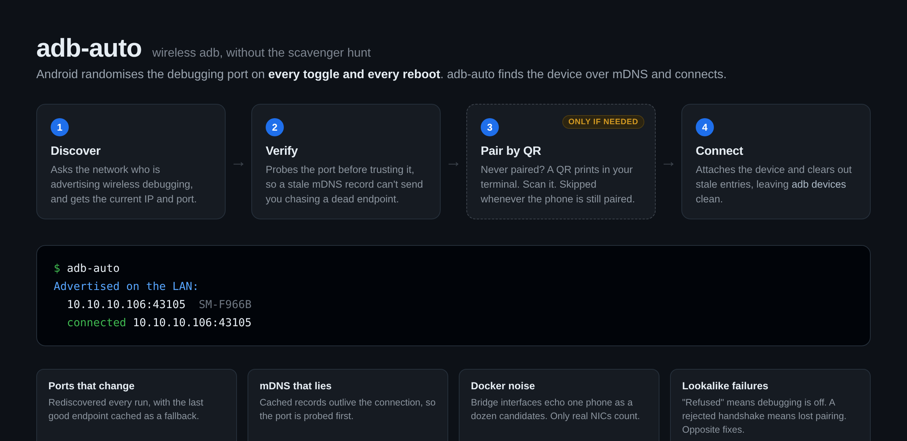

# adb-auto



**Stop hunting for your phone's IP and port. Just run `adb-auto`.**

Android randomises the wireless-debugging port every single time you toggle it or reboot. So the
command that worked yesterday is dead today, and you are back in Settings squinting at a
`192.168.1.x:41055` that will be wrong again in an hour.

`adb-auto` finds the device and connects. That is the whole idea.

```console
$ adb-auto
Advertised on the LAN:
  10.10.10.106:43105  SM-F966B
  connected 10.10.10.106:43105

adb devices:
10.10.10.106:43105     device product:q7qxeea model:SM_F966B device:q7q
emulator-5554          device product:sdk_gphone64_x86_64 model:sdk_gphone64_x86_64
```

No IP to type. No port to look up. No pairing code, unless the phone has genuinely never been paired
with this machine, and even then it hands you a QR instead of six digits.

## Install

```bash
curl -o ~/.local/bin/adb-auto https://raw.githubusercontent.com/logical-and/adb-auto/master/adb-auto
chmod +x ~/.local/bin/adb-auto
```

One file, no runtime, no daemon. Requires:

- `adb` on `PATH` (or set `ADB=/path/to/adb`)
- `avahi-utils` for discovery: `sudo apt install avahi-utils`
- optional, only for QR pairing: `python3 -m pip install --user segno`

## Usage

```
adb-auto            Discover and connect
adb-auto --qr       Pair by QR (nothing to type)
adb-auto --pair     Pair with the 6-digit code
adb-auto --list     Show what is advertised, connect to nothing
```

### It bootstraps itself

Run it with nothing connected and it walks you in, skipping every step you do not need:

1. Tells you to switch Wireless debugging on
2. Notices the device the moment it appears, and connects
3. Only if the phone is not paired, shows a QR for the pairing scanner
4. Connects

Step 3 is skipped whenever the phone is still paired, which is the usual case after a reboot or a
toggle. And if the phone happens to be plugged in over USB, all of it is skipped: `adb-auto` just
switches wireless debugging on itself with `settings put global adb_wifi_enabled 1`, no root needed.

### Pairing without typing anything

`adb-auto --qr` prints a QR straight into your terminal. Scan it with the phone's own pairing
scanner and you are connected.

This works because the direction is inverted: in code mode Android generates the secret and shows it
only on the phone, so no tool can read it. In QR mode **the host** generates the secret and the
phone's camera reads it. Nothing to transcribe.

## The sharp edges it files down

Most of this tool is not "run adb connect". It is the pile of failure modes that make wireless adb
miserable:

**Ports that change under you.** Rediscovered every run. The last working endpoint is cached and
retried for when the phone stops advertising (screen asleep) but keeps the port open.

**`adb devices` filling with corpses.** Stale `ip:port` entries from earlier toggles get
disconnected automatically. Entries for other IPs and for emulators are never touched.

**Two failures that look identical and need opposite fixes.** `Connection refused` means wireless
debugging is off, so it tells you to turn it on. A device that answers but rejects the handshake has
lost its RSA pairing, so it offers the pairing QR. Guessing wrong here wastes real time.

**mDNS lying to you.** Avahi keeps serving a cached record after wireless debugging is switched off,
so an advert alone proves nothing. The port gets probed before a device counts as ready.

**Docker turning one phone into twelve.** Bridge interfaces echo the same advert on every virtual
link. Only real interfaces are considered.

**Silent double-listing.** `ADB_MDNS_OPENSCREEN=1` fixes adb's own discovery but auto-connects
devices under an mDNS-name serial, so a phone also reached by `ip:port` appears **twice**. That
quietly breaks any script that counts devices or picks "the non-emulator one". `adb-auto` avoids the
flag and actively removes the duplicates.

## Why discovery uses avahi, not `adb mdns services`

On many setups adb's default `libadbmdns` backend returns an empty list while `avahi-browse`
resolves the same records in about a second. That single fact is the difference between this tool
working and a minutes-long `nmap` port sweep.

## Why there is no QR for "open wireless debugging"

It is the obvious feature request, and Android will not allow it. Tested on a Galaxy Z Fold 7
(SM-F966B, One UI, API 36), both as raw QR payloads and as tappable links on a locally served page:

| Attempt | Result |
| --- | --- |
| `intent://...action=android.settings.SETTINGS;end` | nothing (Chrome drops package-less intents) |
| `intent:...SETTINGS;package=com.android.settings;end` | opens the Settings **root** only |
| `...APPLICATION_DEVELOPMENT_SETTINGS;package=...` | bounces to the Play Store |
| `component=...Settings$DevelopmentSettingsActivity` | bounces to the Play Store |
| `com.android.settings.APPLICATION_DEVELOPMENT_SETTINGS` | fails to resolve |
| `:settings:fragment_args_key=toggle_adb_wireless` | opens the root, ignores the hint |
| `android.settings.WIRELESS_SETTINGS` | network settings, not debugging |
| `android-app://com.android.settings` | nothing |
| `com.android.settings.action.SETTINGS_SEARCH` | not `BROWSABLE`, fails to resolve |

Two reasons cover all of it. Phone QR scanners only act on `http(s)` payloads, so an `intent:` QR is
inert. And Android only honours scanned links resolving to an activity that declares
`CATEGORY_BROWSABLE`, which Developer options does not, so it is unreachable from a browser even
though `adb shell am start -n com.android.settings/.Settings$DevelopmentSettingsActivity` works fine.

Landing on the Settings root still left you hunting for Developer options, so the QR bought nothing
over printing the path. `adb-auto` prints the path.

## License

MIT
